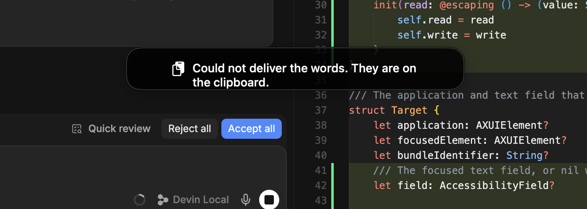

# Hard strand on an unreadable read-back - demo evidence

Captured on macOS 26.5 / Xcode 26.5 from the signed bundle's real entry point
(`make run`, `build/MachVoice.app`), via
`log show --predicate 'subsystem == "com.augustomklee.MachVoice"'`.
Process ids and the subsystem prefix are trimmed from every line below; nothing
else is edited. The Injection Profile snapshots are
`~/Library/Application Support/MachVoice/injection-profile.json` read after
each Utterance, with the entries for other applications left in.

## How the Utterances were driven

The hard strand needs a Target whose Accessibility value reads before the write
and not after. No installed application does that on demand, so the Target is a
purpose-built fixture, `Tools/UnverifiableTarget/main.swift`. Its bottom field
returns `""` for `AXValue` until `AXUIElementSetAttributeValue` is called on it
and `nil` afterwards, which the Accessibility API reports as error `-25212`
(`kAXErrorNoValue`). The fixture is the Target only; mach-voice itself is the
shipped app, unmodified for the demo.

Nobody held the key. A throwaway tool posted a `flagsChanged` event with the
Right Command device flag to the HID event tap, ran `/usr/bin/say` so the
phrase came out of the speakers and into the microphone, then posted the
release. The `[EventTap] Right Command pressed/released` lines are the shipped
tap seeing those events, and the Transcripts are the Speech Model hearing the
synthesiser. Neither tool touches mach-voice.

## 1. Early guard: original value unreadable, falls through to paste (change 1, safe side; change 4)

Fixture run bare, so it has no bundle identifier. Its field had already been
written to once by an Accessibility probe, so the *original* value is
unreadable before any write. Nothing was written, so paste is safe.

Clipboard before: `previous clipboard`.

```
2026-09-02 18:10:13.874 [EventTap] Right Command pressed
2026-09-02 18:10:13.893 [Target] capture: appError=AXError(rawValue: 0) elementError=AXError(rawValue: 0) bundleID=nil hasElement=true
2026-09-02 18:10:13.893 [UtteranceController] Utterance started, target bundleID=nil
2026-09-02 18:10:17.482 [EventTap] Right Command released
2026-09-02 18:10:17.482 [UtteranceController] Utterance ended
2026-09-02 18:10:17.588 [AppDelegate] Transcript: The quick brown fox
2026-09-02 18:10:17.588 [InjectionService] inject: appID=nil preferred=nil hasFocusedElement=true
2026-09-02 18:10:17.588 [InjectionService] attemptAccessibility: original value unreadable, skipping AX write
2026-09-02 18:10:17.588 [InjectionService] inject: probe failed for accessibility
2026-09-02 18:10:17.592 [InjectionService] attemptPaste: posted Cmd+V
2026-09-02 18:10:17.592 [InjectionService] inject: delivered with paste
2026-09-02 18:10:17.593 [UtteranceController] Injected via paste
```

Clipboard 3 s later: `previous clipboard` (paste's deferred restore ran,
because nothing wrote to the pasteboard in between).

Injection Profile after: unchanged, no `nil` or `"unknown"` key.

```
{"com.exafunction.windsurf":"paste","com.apple.TextEdit":"accessibility","org.mozilla.firefox":"paste"}
```

Before this change `attemptPaste` opened with `guard target.bundleIdentifier != nil`,
so this Utterance would have failed paste and keystrokes and lost the words.

## 2. Hard strand: readable before, `.success` on write, unreadable after (changes 1, 2, 3)

Fixture relaunched bare (fresh field, still no identity). Clipboard before:
`previous clipboard`.

```
2026-09-02 18:10:46.248 [EventTap] Right Command pressed
2026-09-02 18:10:46.251 [Target] capture: appError=AXError(rawValue: 0) elementError=AXError(rawValue: 0) bundleID=nil hasElement=true
2026-09-02 18:10:46.251 [UtteranceController] Utterance started, target bundleID=nil
2026-09-02 18:10:49.782 [EventTap] Right Command released
2026-09-02 18:10:49.782 [UtteranceController] Utterance ended
2026-09-02 18:10:49.875 [AppDelegate] Transcript: The quick brown fox
2026-09-02 18:10:49.875 [InjectionService] inject: appID=nil preferred=nil hasFocusedElement=true
2026-09-02 18:10:49.876 [InjectionService] attemptAccessibility: read-back unreadable, unknowable outcome
2026-09-02 18:10:49.876 [InjectionService] inject: accessibility outcome unknowable, stranding without retry
2026-09-02 18:10:49.879 [InjectionService] keepOnClipboard: Stranded Transcript placed on the clipboard
2026-09-02 18:10:49.891 [UtteranceController] Stranded Transcript: The quick brown fox
```

The fixture's own log for the same instant, showing the write did reach it,
which is exactly why the outcome is unknowable:

```
18:10:49.856 UnverifiableTarget UnverifiableField: setAccessibilityValue(Optional(The quick brown fox)); value is unreadable from now on
18:10:49.857 UnverifiableTarget UnverifiableField: setAccessibilityValue(Optional()); value is unreadable from now on
```

No `attemptPaste` or `attemptKeystrokes` line follows the unknowable outcome.

Clipboard 2 s after: `The quick brown fox`. Nothing else was on the
pasteboard, so the Stranded Transcript is what the speaker gets on Cmd+V.

Injection Profile after: unchanged. The Target had no identity, so there is no
key to mark unverifiable under.

The speaker is told through the indicator, which reappears after the
Utterance has ended and dismisses itself:



## 3. One strand per application: bundled fixture, two Utterances (ADR-0002 end to end)

Same binary wrapped in an `.app` with
`CFBundleIdentifier com.augustomklee.UnverifiableTarget`, so the Injection
Profile has a key. Clipboard reset to `previous clipboard` before each
Utterance.

```
2026-09-02 18:11:38.321 [Target] capture: appError=AXError(rawValue: 0) elementError=AXError(rawValue: 0) bundleID=com.augustomklee.UnverifiableTarget hasElement=true
2026-09-02 18:11:38.321 [UtteranceController] Utterance started, target bundleID=com.augustomklee.UnverifiableTarget
2026-09-02 18:11:41.842 [UtteranceController] Utterance ended
2026-09-02 18:11:41.935 [AppDelegate] Transcript: The quick brown fox
2026-09-02 18:11:41.935 [InjectionService] inject: appID=com.augustomklee.UnverifiableTarget preferred=nil hasFocusedElement=true
2026-09-02 18:11:41.935 [Target] readValue: error=AXError(rawValue: 0)
2026-09-02 18:11:41.936 [Target] readValue: error=AXError(rawValue: -25212)
2026-09-02 18:11:41.936 [InjectionService] attemptAccessibility: read-back unreadable, unknowable outcome
2026-09-02 18:11:41.936 [InjectionService] inject: accessibility outcome unknowable, stranding without retry
2026-09-02 18:11:41.940 [InjectionService] keepOnClipboard: Stranded Transcript placed on the clipboard
2026-09-02 18:11:41.947 [UtteranceController] Stranded Transcript: The quick brown fox
2026-09-02 18:11:46.447 [Target] capture: appError=AXError(rawValue: 0) elementError=AXError(rawValue: 0) bundleID=com.augustomklee.UnverifiableTarget hasElement=true
2026-09-02 18:11:46.447 [UtteranceController] Utterance started, target bundleID=com.augustomklee.UnverifiableTarget
2026-09-02 18:11:49.982 [UtteranceController] Utterance ended
2026-09-02 18:11:50.092 [AppDelegate] Transcript: Jumped over the lazy dog
2026-09-02 18:11:50.092 [InjectionService] inject: appID=com.augustomklee.UnverifiableTarget preferred=Optional(MachVoiceKit.InjectionMechanism.paste) hasFocusedElement=true
2026-09-02 18:11:50.095 [InjectionService] attemptPaste: posted Cmd+V
2026-09-02 18:11:50.095 [InjectionService] inject: delivered with paste
2026-09-02 18:11:50.095 [UtteranceController] Injected via paste
```

After Utterance 1: clipboard `The quick brown fox`, and the Injection Profile
now carries the application as unverifiable:

```
{"com.augustomklee.UnverifiableTarget":"paste","com.apple.TextEdit":"accessibility","com.exafunction.windsurf":"paste","org.mozilla.firefox":"paste"}
```

Utterance 2 into the same application: `preferred=paste`, no Accessibility
attempt, `delivered with paste`. Clipboard 0.2 s after: `Jumped over the lazy dog`
(the paste in flight). Clipboard 1 s after: `previous clipboard` (restored).

One Stranded Transcript for the application, never two.

## Build and tests

```
$ swift build
Build complete!

$ swift test --filter InjectionServiceStrandTests
✔ Test unreadableOriginalFallsThroughToPaste() passed
✔ Test unknownIdentityStillInjectsButLearnsNothing() passed
✔ Test unreadableReadBackStrandsWithoutPasteAndMarksUnverifiable() passed
✔ Test unknownIdentityStrandsWithoutLearning() passed
✔ Test pasteRestoresThePreviousClipboardWhenNothingIntervenes() passed
✔ Test pasteRestoreDoesNotOverwriteAStrandedTranscript() passed
✔ Test run with 6 tests in 1 suite passed
```

Red check: with the unknowable branch reverted to `return nil`,
`unreadableReadBackStrandsWithoutPasteAndMarksUnverifiable` and
`unknownIdentityStrandsWithoutLearning` fail, so the test is what holds the
distinction between the two read failures.
