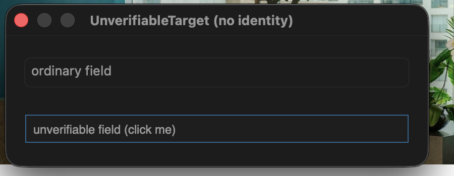
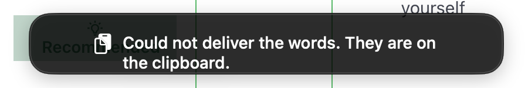
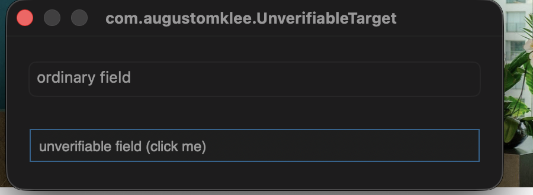

# Hard strand on an unreadable read-back - gate test evidence

Independent re-run of the change at the branch head, `46b68b6`, which is two
review commits ahead of the committed `demo/` capture.
Captured on macOS 26.5 build 25F71, Swift 6.3.2, from the signed bundle built in
this worktree (`make sign`, `build/MachVoice.app`) and launched with `open`, so
every line below comes from the shipped entry point rather than a harness.
Log lines are `log show --predicate 'subsystem == "com.augustomklee.MachVoice"'`
with the process id, the subsystem prefix, the Draft lines and the audio buffer
lines trimmed. The full trimmed log for the session is `session-log.txt`.

## How the Utterances were driven

Nobody held the Dictation Key.
A throwaway poster tool sent a `flagsChanged` event carrying the Right Command
device flag to the HID event tap, `/usr/bin/say` spoke the phrase out of the
speakers and into the microphone, and a second event released the key.
The `[EventTap] Right Command pressed/released` lines are the shipped tap seeing
those events, and the Transcripts are the Speech Model hearing the synthesiser.

The Target is `Tools/UnverifiableTarget/main.swift`, the fixture from the
committed demo: its bottom field answers `AXValue` until
`AXUIElementSetAttributeValue` is called on it and returns `kAXErrorNoValue`
(`-25212`) afterwards.
It was run twice, first as a bare binary with no application identity and then
wrapped in an `.app` with `CFBundleIdentifier com.augustomklee.UnverifiableTarget`.



## 1. Hard strand, Target with no identity

Clipboard before: `previous clipboard`.

```
19:01:03.985 [EventTap] Right Command pressed
19:01:04.004 [Target] capture: appError=AXError(rawValue: 0) elementError=AXError(rawValue: 0) bundleID=nil hasElement=true
19:01:04.004 [UtteranceController] Utterance started, target bundleID=nil
19:01:07.590 [EventTap] Right Command released
19:01:07.590 [UtteranceController] Utterance ended
19:01:07.687 [AppDelegate] Transcript: The quick brown fox
19:01:07.687 [InjectionService] inject: appID=nil preferred=nil hasFocusedElement=true
19:01:07.688 [Target] readValue: error=AXError(rawValue: 0)
19:01:07.688 [Target] readValue: error=AXError(rawValue: -25212)
19:01:07.688 [InjectionService] attemptAccessibility: read-back unreadable, unknowable outcome
19:01:07.688 [InjectionService] inject: accessibility outcome unknowable, stranding without retry
19:01:07.692 [InjectionService] keepOnClipboard: Stranded Transcript placed on the clipboard
19:01:07.707 [UtteranceController] Stranded Transcript: The quick brown fox
```

No `attemptPaste` and no `attemptKeystrokes` line follows the unknowable
outcome, so nothing could be delivered twice.
The fixture's own log for the same instant shows the write did reach it, which
is why the outcome is unknowable rather than a clean failure:

```
19:01:07.701 UnverifiableField: setAccessibilityValue(Optional(The quick brown fox)); value is unreadable from now on
19:01:07.702 UnverifiableField: setAccessibilityValue(Optional()); value is unreadable from now on
```

Clipboard 3 s later: `The quick brown fox`.
The Stranded Transcript is what the speaker gets on Cmd+V, and the Injection
Profile gained no `nil` or `"unknown"` key.

The speaker is told through the indicator, which comes back after the Utterance
has ended and dismisses itself:



## 2. Unreadable original value still falls through to paste

The same fixture, whose field is now written and therefore unreadable *before*
any write.
Nothing can have been written, so this is a clean failure and paste is safe.
Clipboard reset to `previous clipboard`.

```
19:03:12.457 [UtteranceController] Utterance started, target bundleID=nil
19:03:16.174 [AppDelegate] Transcript: Jumped over the lazy dog
19:03:16.174 [InjectionService] inject: appID=nil preferred=nil hasFocusedElement=true
19:03:16.174 [InjectionService] attemptAccessibility: original value unreadable, skipping AX write
19:03:16.174 [InjectionService] inject: probe failed for accessibility
19:03:16.178 [InjectionService] attemptPaste: posted Cmd+V
19:03:16.178 [InjectionService] inject: delivered with paste
19:03:16.178 [UtteranceController] Injected via paste
```

Clipboard 0.25 s after release: `Jumped over the lazy dog`, the paste in flight.
Clipboard 1.5 s after release: `previous clipboard`, the deferred restore having
run because nothing else wrote to the pasteboard.
The Target had no application identity throughout, which the old
`guard target.bundleIdentifier != nil` in `attemptPaste` would have refused.

## 3. One strand per application, end to end

The fixture relaunched from an `.app` so it has an identity, and the
`com.augustomklee.UnverifiableTarget` key removed from the Injection Profile
before mach-voice was restarted, so the profile write is visible.



Injection Profile before:

```
{"com.apple.TextEdit": "accessibility", "com.exafunction.windsurf": "paste", "org.mozilla.firefox": "paste"}
```

```
19:03:58.089 [Target] capture: appError=AXError(rawValue: 0) elementError=AXError(rawValue: 0) bundleID=com.augustomklee.UnverifiableTarget hasElement=true
19:03:58.089 [UtteranceController] Utterance started, target bundleID=com.augustomklee.UnverifiableTarget
19:04:01.765 [AppDelegate] Transcript: The quick brown fox
19:04:01.765 [InjectionService] inject: appID=com.augustomklee.UnverifiableTarget preferred=nil hasFocusedElement=true
19:04:01.765 [Target] readValue: error=AXError(rawValue: 0)
19:04:01.766 [Target] readValue: error=AXError(rawValue: -25212)
19:04:01.766 [InjectionService] attemptAccessibility: read-back unreadable, unknowable outcome
19:04:01.766 [InjectionService] inject: accessibility outcome unknowable, stranding without retry
19:04:01.769 [InjectionService] keepOnClipboard: Stranded Transcript placed on the clipboard
19:04:01.781 [UtteranceController] Stranded Transcript: The quick brown fox
19:04:10.080 [UtteranceController] Utterance started, target bundleID=com.augustomklee.UnverifiableTarget
19:04:13.778 [AppDelegate] Transcript: Jumped over the lazy dog
19:04:13.778 [InjectionService] inject: appID=com.augustomklee.UnverifiableTarget preferred=Optional(MachVoiceKit.InjectionMechanism.paste) hasFocusedElement=true
19:04:13.784 [InjectionService] attemptPaste: posted Cmd+V
19:04:13.784 [InjectionService] inject: delivered with paste
19:04:13.785 [UtteranceController] Injected via paste
```

Injection Profile after the first Utterance:

```
{"org.mozilla.firefox":"paste","com.apple.TextEdit":"accessibility","com.exafunction.windsurf":"paste","com.augustomklee.UnverifiableTarget":"paste"}
```

The second Utterance into the same application opens with `preferred=paste`,
makes no Accessibility attempt at all, and delivers.
Clipboard 0.25 s after that release: `Jumped over the lazy dog`.
Clipboard 1.5 s after: `previous clipboard`.
One Stranded Transcript for the application, never two.

## 4. History

Both Stranded Transcripts and both pasted Transcripts reached History with the
right outcome, read back from
`~/Library/Application Support/MachVoice/history.json` (timestamps UTC):

```
22:04:13  injectionSucceeded=True   'Jumped over the lazy dog'
22:04:01  injectionSucceeded=False  'The quick brown fox'
22:03:16  injectionSucceeded=True   'Jumped over the lazy dog'
22:01:07  injectionSucceeded=False  'The quick brown fox'
```

## 5. A silent Utterance strands nothing

The Dictation Key held for 2 s with nothing spoken (19:02:53 in
`session-log.txt`).
The Speech Model returns no result at all, so no Transcript arrives, and there
is no Injection, no clipboard write and no message.
The empty-Transcript guard added in `46b68b6` sits behind that, unreached from
the microphone in this run.

## 6. Tests

```
$ swift test
✔ Test run with 11 tests in 3 suites passed after 5.108 seconds.
```

The six `InjectionServiceStrandTests` cases are what hold the distinction
between the two read failures apart from the comments.

## The machine after the run

The Injection Profile, the History and the clipboard were snapshotted before the
run and put back afterwards, and both the fixture and the app built here were
quit.
